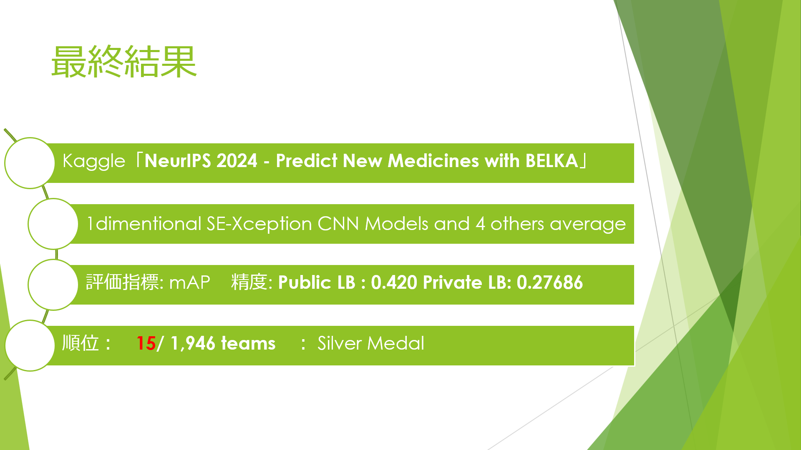
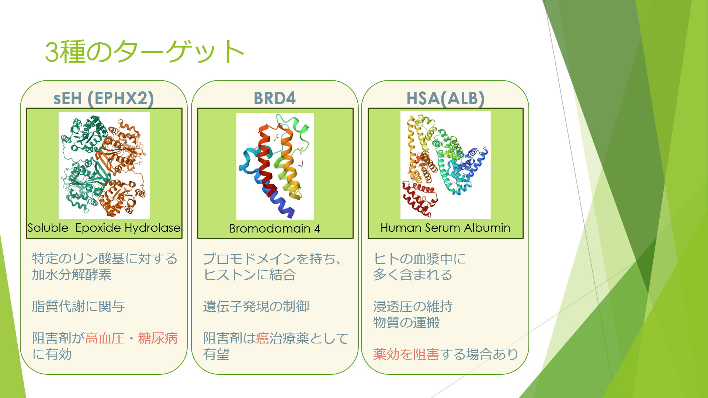
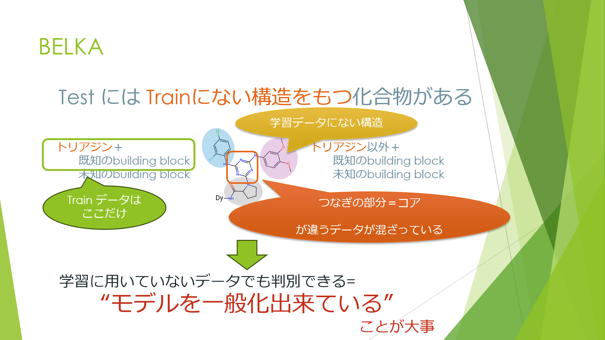
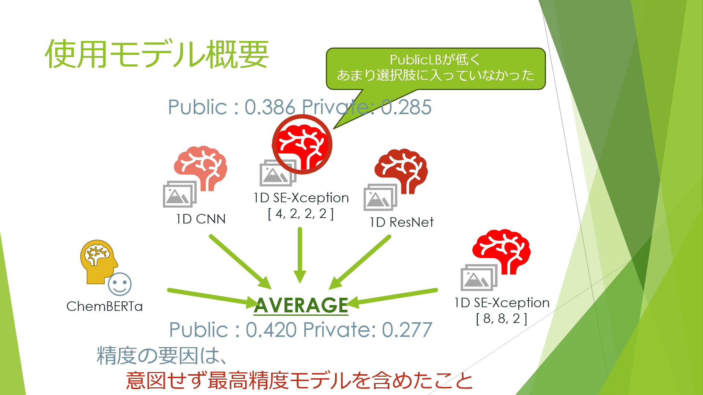
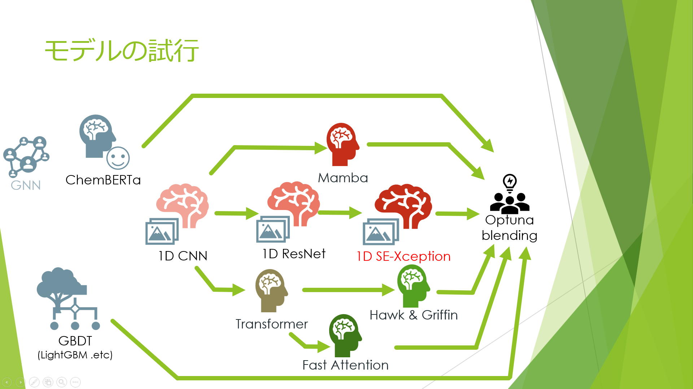
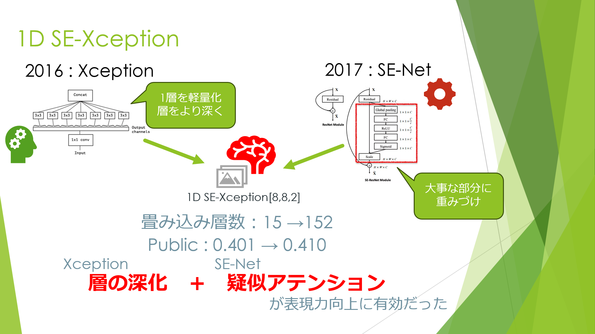
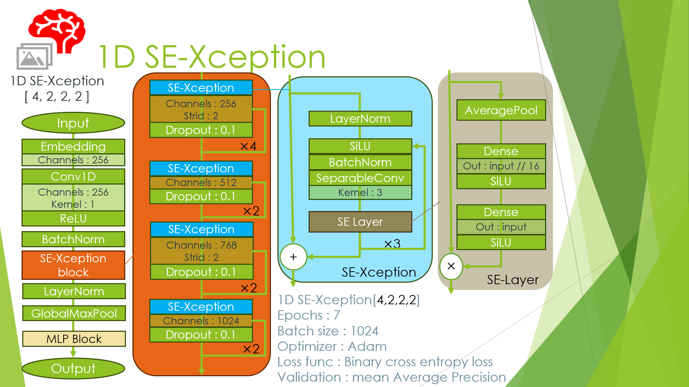
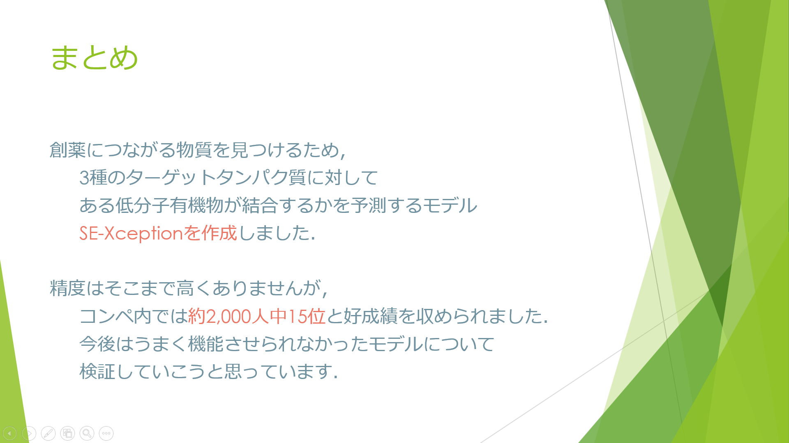

参加したコンペティションで活用したコードのまとめです。

## 参加コンペティション概要

### NeurIPS 2024 - Predict New Medicines with BELKA

**開催期間**: 2024.04.04 ~ 2024.07.09

**主催**:Leash Biosciences

[NeurIPS 2024 - Predict New Medicines with BELKA](https://www.kaggle.com/competitions/leash-BELKA)

### 結果

### 目的

このコンペティションの目的は 、

**SMILES 表記で与えられた低分子有機物が3種のターゲットタンパク質（EPHX2, BRD4, ALB）に対して結合する可能性を予測する** 

ことでした。

### データ

与えられたデータセットBELKAの特徴として以下の点が挙げられます。

- **特徴量**: 分子構造（SMILES表記）、ターゲットタンパク質の名前
- **ターゲット**: `binds`（バイナリ分類: 結合するか否か）
- **評価指標:** mean Average Precision (mAP)
- **データ量**:
    - **学習データ**: 約 **98M** サンプル（1タンパク質あたり）
    - **検証データ**: 約 **200K** サンプル（1タンパク質あたり）
    - **テストデータ**: 約 **360K** サンプル（1タンパク質あたり）
    - **クラス不均衡**: 約 **0.5%** のサンプルのみが結合（`binds=1`）
- **データ形式**: CSVもしくはparquet形式
- **ターゲットタンパク質**（3種類）:
    1. **EPHX2 (sEH)**: 高血圧・糖尿病の治療ターゲット
    2. **BRD4**: 癌の進行に関与するタンパク質
    3. **ALB (HSA)**: 血液中の薬物吸収に関与
    
    
    
- **データの特徴**:
    - DEL (DNA-encoded chemical library) 技術を用いたバインディングデータ
    - 学習データとテストデータの間で構成要素（building blocks）の違いがある
    - タンパク質の配列情報や3D構造（PDB, AlphaFold2）が利用可能
    

---

## 課題点

コンペティションに挑戦するうえで大きく課題となったのは以下の3点でした。

- **リソース制約**:
    
    データが巨大（98M+ サンプル）なのに、自分が利用可能な計算リソースが限られていた
    
    - Kaggle Notebook:
        
        TPU VM v3-8: 20h/week
        
        GPU (T4×2 or P100): 30h/week
        
        連続実行時間: 9h
        
    - Google Colab:
        
        TPU VM v2-8
        
        GPU(T4) 
        
- **CVとLBのギャップ**:
    
     テストデータには未知の構成要素をもつものが7割を占めており、その半数は学習データに存在しないトリアジンでないコア構造を持っていたため、汎化性能を高める必要があった。
    
    
    
    
- **ディープラーニング実装が初めて**:
    
    コンペティションに参加した目的の一つとしてディープラーニングフレームワークの実装を実践で学ぶことがありました。
    
    そのため、モデル構築の経験が浅く、試行錯誤しながら学ぶ必要がありました。
    

---

## 課題への対処

### **1. リソース制約への対処**

こちらの公開Notebookが省データ化と1DCNNによる高速学習を可能としていました。このNotebookを起点に精度向上に取り組みました。

[BELKA 1DCNN Starter with all data](https://www.kaggle.com/code/ahmedelfazouan/belka-1dcnn-starter-with-all-data)

- **SMILESの圧縮(**公開Notebookのアイデア**)**: 
データセットに出現する文字を36種類に特定 → 1~36のIDに変換 → **142カラムの配列へ変換**（省データ化）
    
    各ターゲットへの結合可否の2値分類(98M×3行) → 3ターゲットに対するマルチラベル分類に課題をとらえ直し (学習量を98M×1行に圧縮)
    
- **1D CNNの採用**: 公開Notebookのアイデアをベースにしつつ、**より複雑な構造を模索**
- **ハードウェアに合わせた処理**:
    - TPU: **全データをメモリロード可能(**公開Notebookのアイデア**)**
    - GPU: **StratifiedKFoldで分割 → TFRecord化 → Nvidia DALIでロード**（メモリ負荷軽減）
    

### **2. 汎化性能向上の工夫**

- **アーキテクチャの探索**:
    - **1D CNN, ResNet, SE-Xception, Transformer, Mamba など多様なモデルを試行**
- **アンサンブル手法**:
    - **LightGBM, ChemBERTa, 1D CNN, 1D ResNet, 1D SE-Xception などをブレンド**
    - **単純平均ブレンディング** & **Optunaで加重最適化したブレンディング**
    

### **3. ディープラーニング実装の学習**

- **TensorFlow, PyTorch, PyTorch lightning JAX/Flaxのチュートリアルをこなしつつ、公式ドキュメントを活用**

---

# 結果

### 最終的に選択したモデル

- **1D SE-Xceptionを含む5つのモデルを単純平均したもの**
    - Public LBが最も高かったブレンディングモデルを選択
- **異なるアーキテクチャを持つ1D SE-Xception2つを平均したもの**
    - 単一モデルに近く、複数ブレンディングモデルがオーバーフィットしていた場合に備えて選択

結果的にPrivate LBが最も高くなったのは、Public LBがあまりふるっていなかった、

**Xceptionレイヤー10層の1D SE-Xception**

モデルで、

**Private: 0.28792, Public: 0.38070**

でした。

### モデルの試行

- **LightGBM/ランダムフォレスト + ECFP4**
    - たたき台としてSMILES表記で表された構造からECFP4に変換し、LightGBMおよびランダムフォレストでモデルを作成しました。
- **PyTorch Lightning + ChemBERTa（トランスフォーマーモデルの事前学習を活用）**
    - 分子のSMILES表記をトークナイズし、事前学習済みのChemBERTaでモデル作成しました。
    - 与えられた訓練データの量が多く、リソースの関係でダウンサンプリングを行った結果、精度が芳しくありませんでした。そのため、より軽量で、多くのデータを活用できる方法を模索しました。
- **PyTorch + 1D CNN（計算効率を優先した単純な畳み込みモデル）**
    - TensorFlowで実装された公開NoteBookを参考にPyTorch学習のため実装しました。
    - 全データをTPUメモリ上に展開して高速化を図っていた元NoteBookに対して、KaggleNoteBook上ではPyTorchでTPUのコアが一つしか扱えず、一旦は断念しました。リソースが限られる中、TPUをうまく活用することを優先するため、TensorFlowを用いてCNNのネットワークアーキテクチャを模索する方向にシフトしました。
- **TensorFlow + 1D bottleneckResNet（残差接続による隠れ層数の増加）**
    - CNNの発展系が1次元でも汎化性能向上のために機能するか確認のため実装しました。
- **TensorFlow +1D SE-Xception（XceptionとSE-Netの組み合わせ）**
    - 画像処理で効果的なXceptionとSE-Netのアーキテクチャを1Dデータ向けに適用、これらを組み合わせて、層数やチャネル数を調整して精度向上を目指しました。
    - Public LB 0.401 →410 に向上し、単一モデルの最終候補として採用しました。
- **PyTorch lightning + Mamba（状態空間モデルを活用したシーケンシャルモデル）**
- **PyTorch lightning+ Transformer**
    - FlashAttentionでの実装を試そうとしましたが、内部でtritonを利用している関係で利用可能なリソースの中では、学習させられませんでした。そのため、層数を極力減らして通常のTransformer layer を使って実装しました。
- **モデルのアンサンブル**
    - 1D SE-Xception、1D ResNet、LightGBM、ChemBERTaの組み合わせにより精度を向上させました。
    - Optunaを用いた加重平均の最適化を試みるも、最終的に単純平均したものが最も精度が高くなりました。

### モデルのスコア推移(Private/ Public LB)

| model | Private LB | Public LB | selected |
| --- | --- | --- | --- |
| **1DCNN** | **0.25881** | **0.38397** |  |
| **1D bottleneck ResNet** | **0.24287** | **0.40158** |  |
| **1D SE-Xception v1** | **0.24765**  | **0.36727** |  |
| **1D SE-Xception v2** | **0.25700** | **0.41021** |  |
| **1D SE-Xception v3** | **0.28792** | **0.38070** |  |
| **1D SE-Xception v2 Stratified k-fold 1/15, v3 fold 2/15, average** | **0.27574** | **0.41867** | ✓ |
| **1D SE-Xception v2 Stratified k-fold 1~3/15** | **0.26832** | **0.41179** |  |
| **SE-Xception v1,2,3, ResNet,CNN, chemBERTa average** | **0.27686** | **0.42014** | ✓ |
| **SE-Xceptionv3, ResNet, CNN (blending optimized by optuna)** | **0.26376** | **0.41874** |  |
| **SE-Xception v3, Res,CNN, chemBERTa, lgbm (blending optimized by optuna)** | **0.25295**  | **0.41718** |  |

1D SE-XceptionはXception layerのチャネル数・層数を変更して調整

- **1D SE-Xception v1:  12層**
    
    **[512ch×142seq×2layer→768ch×71seq×4layer→1024ch×36seq×4layer→1280ch×18seq×2layer]**
    
- **1D SE-Xception v2: 18層**
    
    **[256ch×142seq×8layer→512ch×71seq×8layer→768ch×71seq×2layer]**
    
- **1D SE-Xception v3:  10層**
    
    **[256ch×142seq×4layer→512ch×71seq×2layer→768ch×71seq×2layer→1024ch×36seq×2layer]**
    

---

## 工夫点

### 1D SE-Xception

’Squeeze-and-Excitation Networks’([https://arxiv.org/pdf/1709.01507v3.pdf](https://arxiv.org/pdf/1709.01507v3.pdf))
の**SE layer**と、

Xception : Deep Learning with Depthwise Separable Convolutions([https://arxiv.org/pdf/1610.02357](https://arxiv.org/pdf/1610.02357))
の**Xception**を

1次元の1D CNNに応用して組み合わせました。

チャネルごとの重要度で重みづけをする疑似AttentionともいうべきSE layerと、パラメータを減らすことでResNetの層をさらに深くすることを可能にしたXceptionを組み合わせることで、1D CNN系の汎化性能を高めることを狙いました。

チャネル数や積層数を変化させ、精度の高いアーキテクチャを模索しました。

最終的に全データを8Epoch, 16時間ずつ学習させました。

シーケンス長が誤って極端に短くなってしまったv1を除いて、最終的なチャネル数を大きくしたv3が結果的に多くの特徴を捉えることが出来たと考えられ、最も汎化性能が高くなりました。

学習時間の関係でこれ以上の追加学習は厳しかったものの、1D SE-Xception v3は4epochの時の結果に比べて7epochまで学習させたものはpublic LB, Private LBともに順調に精度を向上させているので、さらに追加学習を加えておけばより精度向上が見られたかもしれないと考えられます。

### ブレンディング

先にホールドアウトしたvalidation用のデータを用いてOptuna で重みを最適化し、加重平均による複数モデルのブレンディングを行いました。

結果的にはブレンディングの準備前から作成していた(validation用のデータが異なる)モデルを含めるために重みづけせず単純平均を取ったモデルが、高性能だったSE-Xception v3の結果を取り込む形になり精度がよくなりました。しかし、ブレンディング前の各モデルと比べると精度を向上させることが出来ていました。

**ブレンディング手順**

1. **訓練データの分割、最適化用検証データの確保:**
    
    Stratified K Foldを用いて訓練データを15分割し、1Foldを検証用にホールドアウト。残りの14Fold分のデータもTFRecordに分割して保存。データはnvidia DALIを用いてGPUにロードすることでPyTorchで作成していたモデルにも対応。
    
2. **モデルの学習:**
この訓練データを用いて1D CNN, 1D ResNet, 1D SE-Xception, lightGBM, ChemBERTaを学習。
3. **重みをOptunaで最適化:**
    
    検証用データを用いて、各モデルの出力に対する重みをOptunaで最適化。
    
4. **最適化した重みで加重平均**

---

## 今後の展望

今後の展望として、以下の点に取り組んでいきたいと考えています。

1. **モデルアーキテクチャの見直し**
    
    MambaやFast Attentionを活用して高精度を達成した参加者もいたため、自分のモデルとこれらの手法との違いを分析し、アーキテクチャを見直したいと考えています。特に、現状のモデルに不足している要素や改善点を明確にし、より高い精度を目指します。
    
2. **未知データへの対応強化**
    
    一部のチームが、SMILESデータを用いて事前学習を行ったChemBERTaを活用していたことに注目しました。未知の分子構造への適用性を高めるため、ChemBERTaを活用したアプローチを検討し、未知データ専用のモデルを構築する可能性を探ります。
    
3. **ChemBERTaの深掘り**
    
    今回のコンペではChemBERTaを十分に活用しきれなかったため、もう少し深掘りして、どのように組み込めば効果的なのかを研究します。特に、ChemBERTaの特徴量の取り扱いや、他のモデルとの組み合わせ方について検討を進めていきます。
    

これらの取り組みを通じて、今後のモデル精度向上や新しい手法の開拓を目指していきたいと考えています。

---

## まとめ

